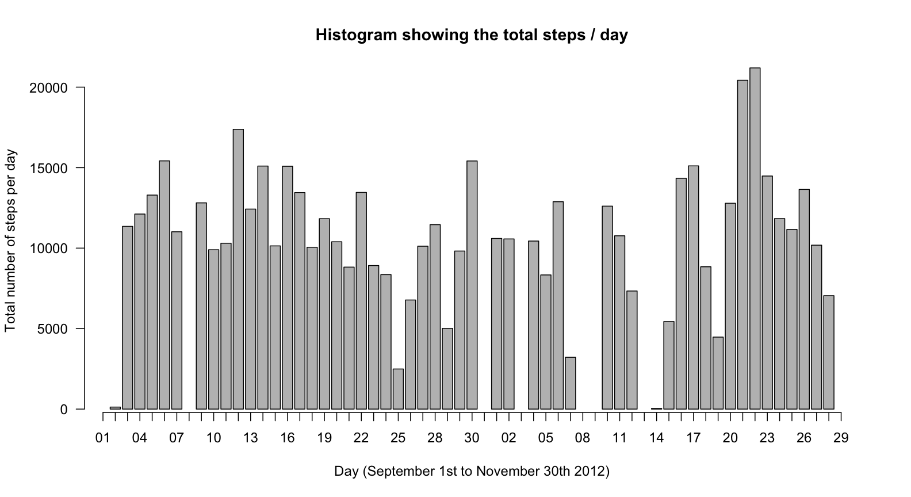
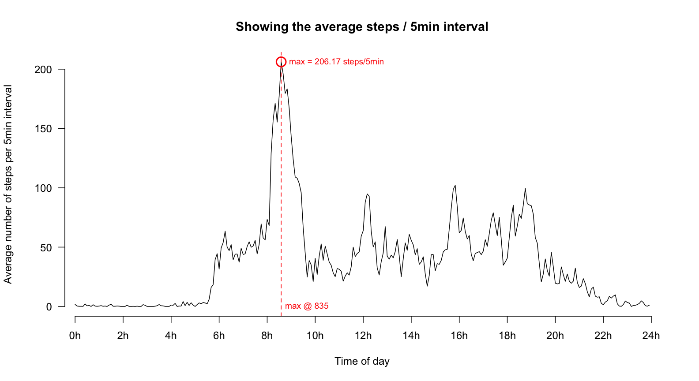
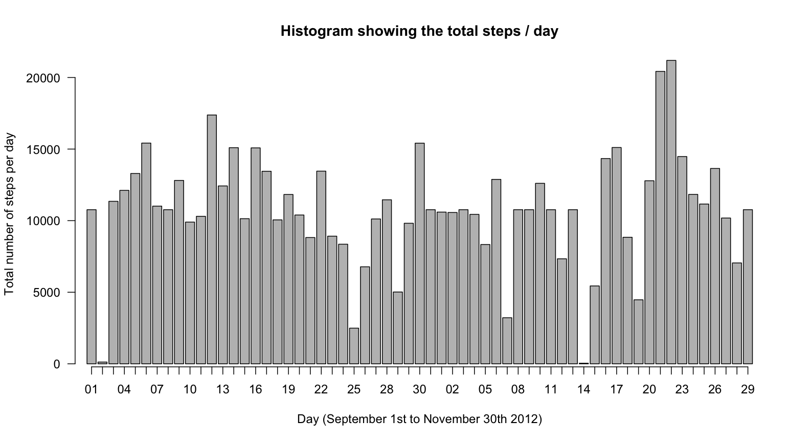

# Reproducible Research: Peer Assessment 1

Setting locale to en_US.

```r
Sys.setlocale("LC_ALL", "en_US")
```

```
## [1] "en_US/en_US/en_US/C/en_US/de_DE.UTF-8"
```

## Loading and preprocessing the data


```r
data <- read.csv("activity.csv")
data$date <- strptime(data$date, format="%Y-%m-%d")
```

## What is mean total number of steps taken per day?

### Histogram showing the total number of steps taken each day

```r
stepsPerDay <- tapply(data$steps, as.Date(data$date), sum)

lPos <- barplot(stepsPerDay,
        xaxt="n", yaxt="n",
        ylab="Total number of steps per day",
        xlab="Day (September 1st to November 30th 2012)",
        main="Histogram showing the total steps / day")
axis(2, las=1, line=-1)

axis(side=1, at=lPos,
     labels=format(seq(min(data$date), max(data$date), by="day"), format="%d") )
```



### Simple Statistics 

The mean for steps / day is __10766.19__.

The median for steps / day is __10765.00__.

## What is the average daily activity pattern?


```r
averagePerInterval <- tapply(data$steps, data$interval, mean, na.rm=TRUE)

plot(averagePerInterval,
        type="l", frame.plot=F, xaxt="n", yaxt="n",
        ylab="Average number of steps per 5min interval", xlab="Time of day",
        main="Showing the average steps / 5min interval")
axis(2, las=1, line=-1)

axis(side=1, at=seq(1, 300, by=24),
     labels=paste0(seq(0, 24, by=2), "h"), cex=0.8)

maxAvg <- which.max(averagePerInterval)
abline(v=maxAvg, col="red", lty=2)
text(y=0, x=maxAvg + 2, label=paste("max @", names(averagePerInterval[maxAvg])), adj=0, col="red", cex=.8)
text(y=averagePerInterval[maxAvg], x=maxAvg + 4, label=sprintf("max = %.2f steps/5min", averagePerInterval[maxAvg]), adj=0, col="red", cex=.8)
points(x=maxAvg, y=averagePerInterval[maxAvg], cex=2, col="red", lwd=2)
```



## Imputing missing values

There are __2304__ values missing in the original dataset.

We create a new copy of that dataset and impute the missing values from the corresponding 5min interval average.


```r
newdata <- data

for(i in seq(1, nrow(data)) ) {
    if ( is.na(data$steps[i]) ) {
        newdata$steps[i] <- averagePerInterval[[as.character(data$interval[i])]]
    }
}
```

### Resulting histogram with imputed data
### Histogram showing the total number of steps taken each day

```r
newStepsPerDay <- tapply(newdata$steps, as.Date(newdata$date), sum)

lPos <- barplot(newStepsPerDay, xaxt="n", yaxt="n",
        ylab="Total number of steps per day", xlab="Day (September 1st to November 30th 2012)",
        main="Histogram showing the total steps / day")
axis(2, las=1, line=-1)

axis(side=1, at=lPos,
     labels=format(seq(min(newdata$date), max(newdata$date), by="day"), format="%d") )
```



### Simple Statistics for new dataset

The new mean for steps / day is __10766.19__.

The new median for steps / day is __10766.19__.

Both values are now identical.
With the original dataset the median was a tiny bit lower than the mean.

## Are there differences in activity patterns between weekdays and weekends?


```r
# create new column which hold true if date is weekday and false if it is weekend
data$weekday <- !(weekdays(data$date, abbreviate=T) %in% c("Sat", "Sun"))

# create seperate averages for 5min intervals for weekdays and weekends
averageWeekday <- tapply(data$steps[data$weekday], data$interval[data$weekday], mean, na.rm=TRUE)
averageWeekend <- tapply(data$steps[!data$weekday], data$interval[!data$weekday], mean, na.rm=TRUE)

weekend.maxavg <- sprintf("%.2f", max(averageWeekend)) # what is the max
weekend.maxat <- as.numeric(names(which.max(averageWeekend))) # at what time is the max
weekday.maxavg <- sprintf("%.2f", max(averageWeekday)) # what is the max
weekday.maxat <- as.numeric(names(which.max(averageWeekday))) # at what time is the max
```

As shown in the graphs below there is quite a difference between weekends (A) and weekdays (B) in total average steps / 5min interval.
On a weekend the maximum average of __175.00__ is at about __915__h (green). But on a weekday the maximum average of __234.10__ is at about __835__h (orange). Thats about __40__min earlier.

The blue lines (a,b,c) in both activity diagrams show times which are quite different between weekends and weekdays.
* a) On weekdays there is a lot more activity between about 6h and 8h present than on a weekend. This is likely to be caused of people getting up early for work.
* b) On weekends there's a lot more activity from noon into the afternoon. This could likely be caused by shopping activities.
* c) On weekends there's also clearly more activity in the early evening. This is likely from social activities.

The activity patterns between weekday and weekend are clearly different!


```r
par(mfrow=c(2,1))
par(mar=c(4.5,4.5,2,1))

# Weekends-Plot
plot(averageWeekend, ylim=c(0,250),
        type="l", frame.plot=F, xaxt="n", yaxt="n",
        ylab="Average number of steps per 5min interval", xlab="Time of day",
        main=expression("A: Showing the "*bold("weekend") *" average steps / 5min interval") )
axis(2, las=1, line=-1)
axis(side=1, at=seq(1, 300, by=24), labels=paste0(seq(0, 24, by=2), "h"), cex=0.8)

# display max-value for weekday/weekend
abline(h=max(averageWeekday), col="orange", lwd=1, lty=2)
abline(v=which.max(averageWeekday), col="orange", lwd=1, lty=2)
text(y=max(averageWeekday)+10, x=20, col="orange", label="max weekday")
points(x=which.max(averageWeekday), y=max(averageWeekday), cex=2, col="orange", lwd=2)
abline(h=max(averageWeekend), col="darkgreen", lwd=1, lty=2)
abline(v=which.max(averageWeekend), col="darkgreen", lwd=1, lty=2)
text(y=max(averageWeekend)+10, x=20, col="darkgreen", label="max weekend")
points(x=which.max(averageWeekend), y=max(averageWeekend), cex=2, col="darkgreen", lwd=2)

lines(x=c(67,97), y=c(-6, -6), col="blue", lwd=2) # get up early on weekdays
text(x=95, y=0, col="blue", label="a")
lines(x=c(145,212), y=c(-6, -6), col="blue", lwd=2) # weekend go shopping!?
text(x=210, y=0, col="blue", label="b")
lines(x=c(236,260), y=c(-6, -6), col="blue", lwd=2) # go party on weekends
text(x=258, y=0, col="blue", label="c")

# Weekdays-Plot
plot(averageWeekday, ylim=c(0,250),
        type="l", frame.plot=F, xaxt="n", yaxt="n",
        ylab="Average number of steps per 5min interval", xlab="Time of day",
        main=expression("B: Showing the "*bold("weekday") *" average steps / 5min interval") )
axis(2, las=1, line=-1)
axis(side=1, at=seq(1, 300, by=24), labels=paste0(seq(0, 24, by=2), "h"), cex=0.8)

# display max-value for weekday/weekday
abline(h=max(averageWeekday), col="orange", lwd=1, lty=2)
abline(v=which.max(averageWeekday), col="orange", lwd=1, lty=2)
text(y=max(averageWeekday)+10, x=20, col="orange", label="max weekday")
points(x=which.max(averageWeekday), y=max(averageWeekday), cex=2, col="orange", lwd=2)
abline(h=max(averageWeekend), col="darkgreen", lwd=1, lty=2)
abline(v=which.max(averageWeekend), col="darkgreen", lwd=1, lty=2)
text(y=max(averageWeekend)+10, x=20, col="darkgreen", label="max weekend")
points(x=which.max(averageWeekend), y=max(averageWeekend), cex=2, col="darkgreen", lwd=2)